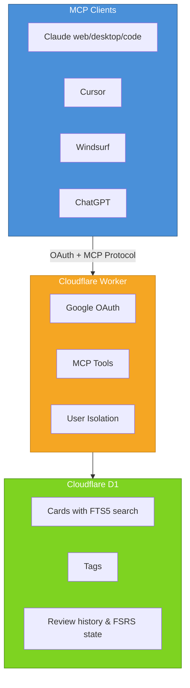

# Spaced Repetition MCP Server

A remote [Model Context Protocol](https://modelcontextprotocol.io) server that provides spaced repetition tool to Claude, Claude Code, Cursor, Amp and other MCP clients. I strongly suggest using a non-thinking fast model (eg Claude Haiku 4.5 with thinking off).

For ChatGPT:
go to Settings > Apps > Advanced settings, enable Developer Mode, and then connect to the MCP server.

## Quick Start

```
Add this URL to your MCP client:
https://spaced-mcp-server.spaced-repetition-mcp.workers.dev/mcp
```

https://github.com/user-attachments/assets/f0841d5b-f7f4-45e4-a52b-a9b6ba47e670

## Why use this? 

A few reasons:

1.  *instructions* for Claude to generate questions instead of static cards. Often, I found myself memorizing the answer to the specific question I had put on an Anki card rather than getting better at solving that _type of problem_. This system solves that - you can simply tell claude "generate X type of problem" and you will get a unique question each time, preventing memorization.

**Normal flashcard:**

```
Q: What is a Python decorator?
A: A function that wraps another function
```

**SR MCP card:**

```
Instructions: Generate and ask the user a simple problem about Python decorators.
```


2. Because you are simply talking to an LLM, it can give you targeted feedback. Often when using Anki I would work on a problem, see the correct answer and then... not know how to change my approach. With this system, I learn much faster.

3. Because it is an MCP, you can hook it up to whichever AI you pay for - this means you don't need to buy credits! It also means that you can frictionlessly create flashcards from whatever content you have been talking with the LLM about by simply asking.

**Example conversation:**

```
You: "Add cards for the subject you just tutored me on"
Claude: 
[Uses add cards tool to add cards]

You: "Quiz me on the due cards"
Claude: 
[Uses the get_due_cards tool]
[Writes you custom practice problem based on the cards]

You: [Answers the problems]
Claude: 
[Provides you targeted feedback, rates your understanding 1-4]
[Uses the review_card tool to submit the review]
{On the remote server, the next optimal review time is calculated by the FSRS-5 alogrythm}
```
## Architecture 



privacy note: there is currently no mechanism to prevent me from reading your cards - if enough people start using this I will add one. In the meantime, feel free to clone this and set it up for yourself (your coding agent of chjoice should be able to do it easily and cloudflair's free tier means you don't need to pay!)

## Credits

- [Model Context Protocol](https://modelcontextprotocol.io)
- [Cloudflare MCP Templates](https://github.com/cloudflare/ai/tree/main/demos)
- [FSRS Algorithm](https://github.com/open-spaced-repetition/fsrs4anki/wiki/The-Algorithm)
- [ts-fsrs](https://github.com/open-spaced-repetition/ts-fsrs)


## License

GPL-3.0
