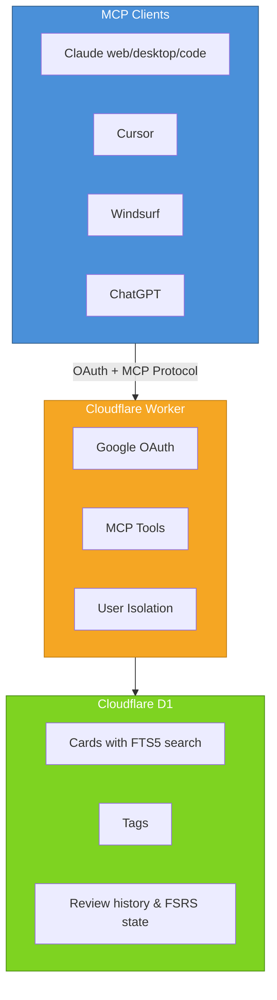

# Spaced Repetition MCP Server

A remote [Model Context Protocol](https://modelcontextprotocol.io) server that provides spaced repetition tool to Claude, Claude Code, Cursor, Amp and other MCP clients (including ChatGPT if you turn on developer mode I think).

https://github.com/user-attachments/assets/f0841d5b-f7f4-45e4-a52b-a9b6ba47e670

## Quick Start

```
Add this URL to your MCP client:
https://spaced-mcp-server.spaced-repetition-mcp.workers.dev/mcp
```

## Why use this? 

Traditional spaced repetition apps use static flashcards. This system stores *instructions* for Claude to generate dynamic practice problems:

**Traditional flashcard:**

```
Q: What is a Python decorator?
A: A function that wraps another function
```

**Spaced repetition MCP card:**

```
Instructions: Generate and ask the user a simple problem about Python decorators.
```

Claude reads these instructions and generates fresh, personalized practice every time.

Because it is an LLM, it can give you targeted feedback. Often when using Anki I would work on a problem, see the correct answer and then... not know how to change my approach. With this system, I learn much faster.

Because it is an MCP, you do not need to pay for seperate credits, and you can frictionlessly create flashcards.

**Example conversation:**

```
You: "Add cards for the subject you just tutored me on"
Claude: 
[Uses add cards tool to add cards]

You: "Quiz me on the due cards"
Claude: 
[Uses the get_due_cards tool]
[Writes you custom practice problem based on the cards]

You: [Answers the problems]
Claude: 
[Provides you targeted feedback, rates your understanding 1-4]
[Uses the review_card tool to submit the review]
{On the remote server, the next optimal review time is calculated by the FSRS-5 alogrythm}
```

## Architecture

- **Runtime**: Cloudflare Workers (serverless)
- **Database**: Cloudflare D1 (SQLite with FTS5)
- **Auth**: Google OAuth via workers-oauth-provider
- **Protocol**: MCP (Model Context Protocol)
- **Language**: TypeScript
- **Algorithm**: FSRS (Free Spaced Repetition Scheduler) via ts-fsrs



## Credits

- [Model Context Protocol](https://modelcontextprotocol.io)
- [Cloudflare MCP Templates](https://github.com/cloudflare/ai/tree/main/demos)
- [FSRS Algorithm](https://github.com/open-spaced-repetition/fsrs4anki/wiki/The-Algorithm)
- [ts-fsrs](https://github.com/open-spaced-repetition/ts-fsrs)


## License

GPL-3.0
